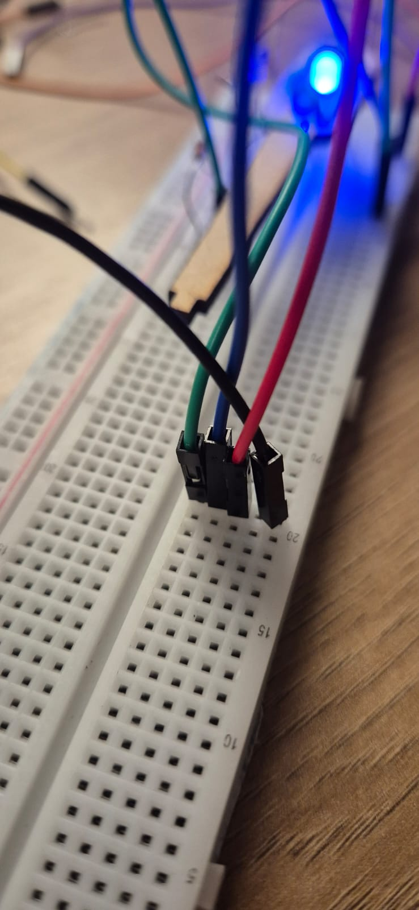

PARTE: RESISTOR LED1 LED2 LED3 ARDUINO
ESPECIFICACAO: 346.5 Ω VERMELHO AZUL VERDE ARDUINO UNO
Foi providenciado um guia de montagem no tinker cad

A montagem fisica utilizou um protoboard. Houve um problema onde o LED azul teve pernas longas demais, entao ficou desorganizado os caminhos tomados pelos fios...  
Etapa 1: Connectar os cabos para as portas 654  
  
Etapa 2: Connectar um cabo (verde) para um resistor, e o resistor para o cabo  
  
Etapa 3: Realizar o mesmo para o azul e o vermelho. Nesse casom conectamos para a parte que usualmente é negativa devido restricoes na montegem  
  
Etapa 4: Connectar o outro lado dos LEDS para um so lugar, com um cabo preto
  
Etapa 5: Finalmete, connectar o preto para o GND
  
